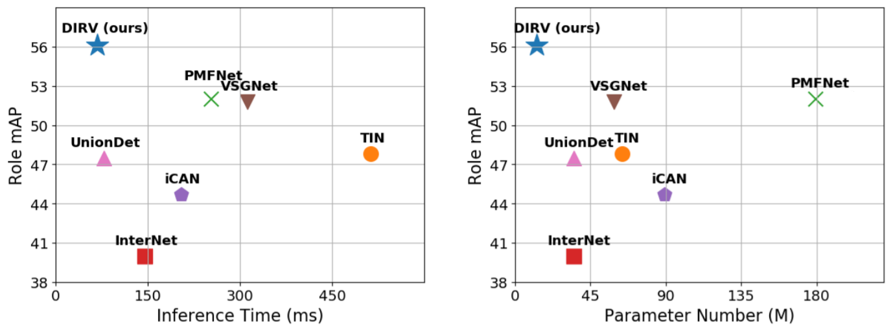

# DIRV: Dense Interaction Region Voting for End-to-End Human-Object Interaction Detection

<div align="center">
    
</div>

Official code implementation for the paper "DIRV: Dense Interaction Region Voting for End-to-End Human-Object Interaction Detection" (AAAI 2021) [paper](https://arxiv.org/abs/2010.01005).

The code is developed based on the architecture of [zylo117/Yet-Another-EfficientDet-Pytorch](https://github.com/zylo117/Yet-Another-EfficientDet-Pytorch). We sincerely thank the author for the excellent work.


## Checklist

+ [x] Training and Test for V-COCO dataset
+ [x] Training and Test for HICO-DET dataset
+ [x] Demonstration on images
+ [ ] Demonstration on videos
+ [ ] More efficient voting strategy for inference using GPU

## Prerequisites

The code was tested with python 3.6,  pytorch 1.5.1, torchvision 0.6.1, CUDA 10.2, and Ubuntu 18.04.

## Installation 

1. Clone this repository:

   ```
   git clone https://github.com/MVIG-SJTU/DIRV.git
   ```

2. Install pytorch and torchvision:

   ```
   pip install torch==1.5.1 torchvision==0.6.1
   ```

3. Install other necessary packages:

   ```
   pip install pycocotools numpy opencv-python tqdm tensorboard tensorboardX pyyaml webcolors
   ```

## Data Preparation

### V-COCO Dataset:

Download [V-COCO](https://github.com/s-gupta/v-coco) dataset following the official instructions. 

You can find the file new_prior_mask.pkl [here](https://drive.google.com/drive/folders/14xXUb5l_SugfWiRXX3o8jgKXMNac1c7_?usp=sharing). Each element inside it refers to the prior probability that a verb (e.g. eat) is associated with an object category (e.g. apple).

### HICO-DET Dataset:

Download [HICO-DET](http://www-personal.umich.edu/~ywchao/hico/) dataset from the official website.

We transform the annotations of HICO-DET dataset to JSON format following [BigRedT/no_frills_hoi_det](https://github.com/BigRedT/no_frills_hoi_det). You can directly download the processed annotations from [here](https://drive.google.com/drive/folders/14xXUb5l_SugfWiRXX3o8jgKXMNac1c7_?usp=sharing). Thanks for their hard work!

We count the training sample number of each category in [hico_processed/hico-det_verb_count.json](https://drive.google.com/drive/folders/14xXUb5l_SugfWiRXX3o8jgKXMNac1c7_?usp=sharing). It serves as a weight when calculating loss.

### Dataset Structure:

Make sure to put the files in the following structure:

```
|-- datasets
|   |-- vcoco
|	|	|-- data
|	|	|	|-- splits
|	|	|	|-- vcoco
|	|	|
|	|	|-- coco
|	| 	|	|-- images
|	|	|	|-- annotations
|	|	|-- new_prior_mask.pkl   
|   |-- hico_20160224_det
|   |   |-- images
|   |   |-- hico_processed
```

## Demonstration
### Demonstration on Images

```
CUDA_VISIBLE_DEVICES=0 python demo.py --image_path /path/to/a/single/image
```

### Demonstration on Videos

Coming soon.

## Pre-trained Weights

You can download the pre-trained weights for V-COCO dataset (vcoco_best.pth) [here](https://drive.google.com/drive/folders/14xXUb5l_SugfWiRXX3o8jgKXMNac1c7_?usp=sharing).

## Training

Download the pre-trained weight of our backbone [here](https://drive.google.com/drive/folders/14xXUb5l_SugfWiRXX3o8jgKXMNac1c7_?usp=sharing), and save it in `weights/` directory. 

### Training on V-COCO Dataset

```
CUDA_VISIBLE_DEVICES=0,1,2,3 python train.py -p vcoco --batch_size 32 --load_weights weights/efficientdet-d3_vcoco.pth
```

### Training on HICO-DET Dataset

```
CUDA_VISIBLE_DEVICES=0,1,2,3,4,5,6,7 python train.py -p hico-det --batch_size 48 --load_weights weights/efficientdet-d3_hico-det.pth
```

You may also adjust the saving directory and GPU number in `projects/vcoco.yaml` and `projects/hico-det.yaml` or create your own projects in `projects/`.

## Test 

### Test on V-COCO Dataset

```
CUDA_VISIBLE_DEVICES=0 python test_vcoco.py -w $path to the checkpoint$
```

### Test on HICO-DET Dataset

```
CUDA_VISIBLE_DEVICES=0 python test_hico-det.py -w $path to the checkpoint$
```

## Citation

If you found our paper or code useful for your research, please cite the following paper:
```
@inproceedings{fang2020dirv,
      title={DIRV: Dense Interaction Region Voting for End-to-End Human-Object Interaction Detection}, 
      author={Fang, Hao-Shu and Xie, Yichen and Shao, Dian and Lu, Cewu},
      year={2021},
      booktitle = {The AAAI Conference on Artificial Intelligence (AAAI)}
}
```

